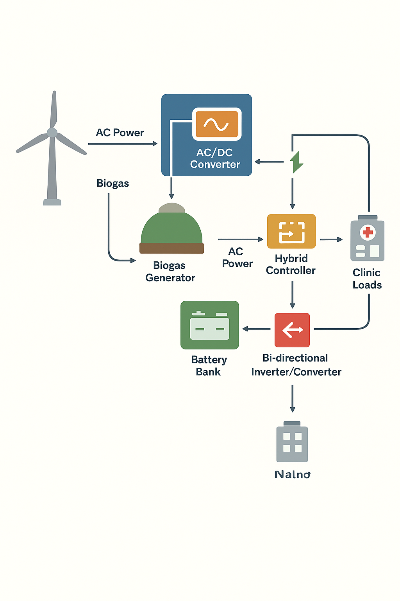

#  Wind–Biogas Hybrid System Architecture for a Rural Health Clinic

The hybrid system is designed as a **standalone, off-grid microgrid**, combining two renewable energy sources — an **intermittent/variable source (wind)** and a **controllable source (biogas generator)** — integrated with **energy storage** for reliability and continuous power supply.

---

## System Architecture

The power flow can be summarized as follows:

  
   
  <em>Figure 1: Hybrid OTEC System Block Diagram showing warm and cold water loops, turbine-generator, condenser, and freshwater output.</em>

The DC power from the wind turbine (via the rectifier/converter) and the AC power from the biogas generator are managed by a **central Hybrid Controller** and routed to the **Battery Bank (Storage)** through a **Bi-directional Inverter/Converter**.  
The inverter converts stored DC power to AC for the clinic's loads.

The **Biogas Generator** acts as a **reliable backup/complementary source**, used to charge batteries or directly power the load when wind generation is low.

---

## System Explanation and Relevance

### 🔹 Source of Energy

The system utilizes two distinct renewable sources:

- **Wind Energy:** Generated by wind turbines that capture the kinetic energy of air movement. This resource is intermittent and depends on local wind speed, typically varying throughout the day and across seasons.

- **Biogas Energy:** Derived from the anaerobic digestion of organic matter (e.g., animal manure, agricultural waste, community organic waste) in a sealed digester. This process produces biogas, primarily composed of methane ($CH_4$) and carbon dioxide ($CO_2$).  
  This source is **controllable** and relatively continuous since feedstock can be stored and fed as needed.

---

### 🔹 Conversion Process

- **Wind:**  
  The kinetic energy of the wind rotates the turbine blades, turning a shaft connected to an electric generator to produce **AC power**.  
  This AC power is then **rectified to DC** through a converter to charge the battery bank or supply DC loads via a charge controller.

- **Biogas:**  
  The biogas is first **cleaned** (e.g., hydrogen sulfide removal) and then fed into a specially designed **Internal Combustion Engine (ICE)** or gas turbine coupled to an **electric generator**, producing **AC electrical power**.

---

### 🔹 Output / Utilization

The hybrid system delivers **regulated AC electrical power** to the rural health clinic’s loads.  
Power utilization includes:

- **Critical Medical Loads:**  
  - Vaccine refrigerators and freezers (vaccine cold-chain preservation)  
  - Emergency and operating room lighting  
  - Essential medical devices (e.g., monitors, sterilization units)

- **Essential Support Loads:**  
  - General lighting and ventilation  
  - Communication and IT equipment  
  - Staff device charging and basic appliances  

The **Battery Bank** stores excess energy from both wind and biogas sources, ensuring **uninterrupted power** during low-wind periods or when the biogas generator is offline for maintenance.

---

### 🔹 Real-World Application Relevance

Hybrid renewable energy systems like **Wind–Biogas** are highly relevant for **off-grid rural health clinics** in developing regions such as **Sub-Saharan Africa** and **South Asia**.

**Context from Literature:**  
According to studies and guidelines from the **World Health Organization (WHO)** and the **National Renewable Energy Laboratory (NREL)**, **reliable electricity access** is a prerequisite for effective healthcare delivery.  
Without consistent power:
- Vaccine cold chains fail, rendering vaccines useless.  
- Surgical and maternity services cannot be safely performed at night.  
- Diagnostic and sterilization equipment become inoperable.  

The **Wind–Biogas hybrid** model offers enhanced **reliability** by balancing the **intermittency of wind** with the **dispatchable nature of biogas**.  
Moreover, **biogas production** integrates **waste management** into the energy cycle — utilizing locally available organic waste and generating economic value (e.g., fertilizer by-products) for the community.  

This results in a **sustainable, low-carbon, and cost-effective power solution**, reducing dependence on expensive and polluting diesel generators while ensuring continuous power for essential healthcare operations.

---

